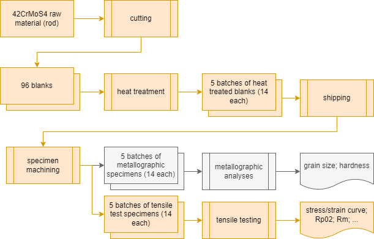

# pmd_referenceproject

This repository contains data from a joint project between Fraunhofer IWM, Freiburg and IWT, Bremen. The provided python scripts generate a structured dataset using the [PMDco v2.0.7](https://github.com/materialdigital/core-ontology) and [TTO v2.0.1](https://github.com/materialdigital/application-ontologies). The resulting ABox is published to [github-pages](https://materialdigital.github.io/demodata_tensiletest_42CrMoS4/) as .ttl and .rdf alongside all references file resources.

## About the described scientific data
The scientific task in the project was to analyse the relation between grain size and yield strength (Hall-Petch-Relation) on 42CrMoS4. The image below gives an overview over the experimental steps. The raw material was aquired as rod and machined to blanks. These blanks were heat treated (quenched and tempered) in five batches with different austenitisation temperatures each ({850 °C, 925 °C, 1000 °C, 1075 °C, 1150 °C}). The specimens were then shipped from the first project partner (IWT) to the second project partner (IWM), where tensile test specimens as well as metallographic specimens were machined and tested or examined, respectively.



## About the generated A-Box
Using a highly customized and rudimentary pipeline consisting of the python scripts in this repo, a RDF representation of the scientific data acquired during the research process is generated. The representation uses the [PMDco v2.0.7](https://github.com/materialdigital/core-ontology) and the [TTO v2.0.1](https://github.com/materialdigital/application-ontologies). The metallography section (gray boxes in the image) is not part of the RDF dataset as there is currently no application level ontology known to the authors, that is applicable. The resulting ABox is published to [github-pages](https://materialdigital.github.io/demodata_tensiletest_42CrMoS4/) as .ttl and .rdf and dereferenceable in its namespace [https://w3id.org/pmd/demodata/tensiletest_42CrMoS4/](https://w3id.org/pmd/demodata/tensiletest_42CrMoS4/) alongside all references file resources.

## Accessing the content
The RDF-data and all resources are published using gh-pages and [w3id.org](https://w3id.org/). Accessing the URI [`https://w3id.org/pmd/demodata/tensiletest_42CrMoS4/`](https://w3id.org/pmd/demodata/tensiletest_42CrMoS4/) (or the versioned URIs [`.../latest/`](https://w3id.org/pmd/demodata/tensiletest_42CrMoS4/latest/) or [`.../1.0.0/`](https://w3id.org/pmd/demodata/tensiletest_42CrMoS4/1.0.0/)) in a web browser (technically with an accept-header `application/xhtml+xml` or `text/html`) will return a landing page listing download links for the `rdf`, `turtle` and `json-ld` serializations of the dataset and all resources. The rdf data can also be accessed by invoking request with an applicable accept header (`application/rdf+xml`, `text/turtle` or `application/ld+json`). See below for examples.

### Powershell snippets for getting rdf data
**CAVE**: `Out-File -Encoding utf8` behaves differently depending on the powershell version. In `powershell 5.1` this creates a file with `UTF-8-BOM`-encoding. In newer versions (`>7.2`) this can be changed.

#### rdf serialization
```ps
$(Invoke-WebRequest -Uri https://w3id.org/pmd/demodata/tensiletest_42CrMoS4/ -Headers @{'accept' = 'application/rdf+xml'}).Content | Out-File -FilePath tensiletest_42CrMoS4.rdf -Encoding utf8
```
#### turtle serialization
```ps
$(Invoke-WebRequest -Uri https://w3id.org/pmd/demodata/tensiletest_42CrMoS4/ -Headers @{'accept' = 'text/turtle'}).Content | Out-File -FilePath tensiletest_42CrMoS4.ttl -Encoding utf8
```
#### json-ld serialization
```ps
$r = Invoke-WebRequest -Uri https://w3id.org/pmd/demodata/tensiletest_42CrMoS4/ -Headers @{'accept' = 'application/ld+json'}; [System.Text.Encoding]::UTF8.GetString($r.Content) | Out-File -FilePath tensiletest_42CrMoS4.jsonld -Encoding utf8
```

### Bash snippets for getting rdf data
#### rdf serialization
```bash
curl -L -H 'Accept: application/rdf+xml' https://w3id.org/pmd/demodata/tensiletest_42CrMoS4/ > tensiletest_42CrMoS4.rdf
```
#### turtle serialization
```bash
curl -L -H 'Accept: text/turtle' https://w3id.org/pmd/demodata/tensiletest_42CrMoS4/ > tensiletest_42CrMoS4.ttl
```
#### json-ld serialization
```bash
curl -L -H 'Accept: application/ld+json' https://w3id.org/pmd/demodata/tensiletest_42CrMoS4/ > tensiletest_42CrMoS4.jsonld
```

**The repo is currently WIP**
